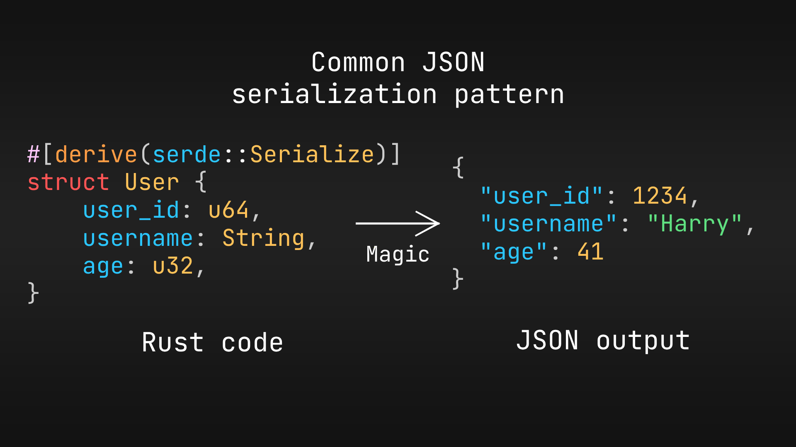

# Derive macro example

[![Build Icon]][Build Status]&emsp;[![License CC0 Icon]][LICENSE CC0]&emsp;[![License Unlicense Icon]][License Unlicense]

[Build Icon]: https://img.shields.io/github/actions/workflow/status/1git2clone/proc-macro-example/ci.yml?branch=main
[Build Status]: https://github.com/1git2clone/proc-macro-example/actions?query=branch%3Amain
[License CC0 Icon]: https://img.shields.io/badge/license-CC0_1.0_Universal-blue.svg
[License CC0]: LICENSE-CC0
[License Unlicense Icon]: https://img.shields.io/badge/license-Unlicense-blue.svg
[License Unlicense]: LICENSE-UNLICENSE

A short getting started on derive macros guide in Rust.

> [!IMPORTANT]
> This assumes you're familiar with Rust's declarative macros. Or at least
> knowledgeable of programming language syntax and meaning of words like:
> `identifier` and `expression`.[^1] [^2] [^3] [^4] [^5]

[^1]: <https://doc.rust-lang.org/reference/macros-by-example.html#metavariables>

[^2]: <https://doc.rust-lang.org/reference/items.html>

[^3]: <https://doc.rust-lang.org/reference/attributes.html>

[^4]: <https://doc.rust-lang.org/reference/statements-and-expressions.html>

[^5]: <https://doc.rust-lang.org/reference/names.html>

## Table of Contents

---

- [Derive macro example](#derive-macro-example)
  - [Table of Contents](#table-of-contents)
  - [What will be discussed](#what-will-be-discussed)
    - [Front-end, back-end and intermediate representation](#front-end-back-end-and-intermediate-representation)
  - [What will be done](#what-will-be-done)
    - [Usage example](#usage-example)
  - [Insight and resources](#insight-and-resources)
    - [Source code sources](#source-code-sources)
    - [Video sources](#video-sources)
  - [License](#license)

---

## What will be discussed

1. A quick introduction to the three main types of declarative macros[^6]:

   1.1. Function-like - `my_function_like_macro!(...)` **(Not to be confused with
   declarative macros)**.

   1.2. Derive - `#[derive(MyDeriveMacro)]` _(We'll focus on this one)_.

   1.3 Attribute - `#[my_attribute_macro]`.

2. How to manage your thought process about the structuring of your crates and
   the structure of the macro.
3. Understanding the process of creating a procedural macro and how it varies
   from declarative macros.
4. Introduction to the common tools to achieve the task: the
   [`syn`](https://docs.rs/syn/ "docs.rs/syn") and
   [`quote`](https://docs.rs/quote/ "docs.rs/quote") crates.

[^6]: <https://doc.rust-lang.org/reference/procedural-macros.html#r-macro.proc.intro>

### Front-end, back-end and intermediate representation

Similarly to how compilers work, procedural macros work by taking some input,
doing something with it, then generating new input for our main program. This
is also the reason procedural macros need a separate crate in order to work.

Fortunately, most of the heavy lifting (parsing and generating Rust code) is
already done with the help of `syn` and `quote`. This means that for Rust code
generation, we can focus on the logic behind what we want to achieve more than
making a parser for the complex syntax of the language.


1. Syn handles the parsing (usually as
   [`syn::DeriveInput`](https://docs.rs/syn/latest/syn/struct.DeriveInput.html)
   for derive macros).
2. We work with the parsed data.
3. Our work gets tokenized by the
   [`quote::quote!`](https://docs.rs/quote/latest/quote/macro.quote.html)
   macro.

## What will be done

An example project using a common pattern called: [`Reflective
programming`](https://en.wikipedia.org/wiki/Reflective_programming). The derive
macro will work on structs and enums and add a method to them called:
`get_fields()` for structs and `get_variants()` for enums.

> "How does this reflect in the real world?"

Retrieving field names is a commonly used thing when we want to represent a
Rust structure in a different format. This is the default way of
[`serde`](https://docs.rs/serde/ "docs.rs/serde")
([serde_derive/src/pretend.rs#64-76](https://docs.rs/serde_derive/1.0.217/src/serde_derive/pretend.rs.html#64-76))
to serialize your struct fields and enum variants.

### Usage example

Here's an example of how `serde` would serialize a `User` object defined like so:



<!-- markdownlint-disable MD013 -->
<!-- Reason: Rust's format standard is 100 column lines. -->

```rust
use proc_macro_example_derive::Reflective;

#[derive(serde::Serialize, Reflective)]
struct User {
    pub user_id: u64,
    pub username: String,
    pub age: u32,
}

let some_user = User {
    user_id: 1234,
    username: String::from("Harry"),
    age: 41,
};
let fields = User::get_fields();
//           ^--------------- How convenient. This is a good example of how this macro can be used
//           to streamline the testing process.
let expected = format!(
    r#"{{"{}":{},"{}":"{}","{}":{}}}"#,
    fields[0], some_user.user_id, fields[1], &some_user.username, fields[2], some_user.age
);
assert_eq!(serde_json::to_string(&some_user).unwrap(), expected);
```

<!-- markdownlint-enable MD013 -->

## Insight and resources

If you've used [`yew`](https://docs.rs/yew/ "docs.rs/yew"),
[`leptos`](https://docs.rs/leptos/ "docs.rs/leptos") or any other web
development library, then you'd know you can parse any `TokenStream` into a
Rust `TokenStream`. This example doesn't go that in-depth with what you can do
since in practice it's possible to make a programming language with Rust's proc
macros. In fact, people have also done that with a
[Python interpreter written in Rust](https://github.com/RustPython/RustPython "GitHub/RustPython/RustPython")
or [Python bindings in Rust](https://github.com/PyO3/pyo3 "GitHub/PyO3/pyo3").

The possibilities are endless and this example just scratches the surface of
procedural macros.

### Source code sources

Some other projects whose procedural macros you can check out are:

<!-- markdownlint-disable MD013 -->

- [the `synstructure` crate](https://github.com/mystor/synstructure "GitHub/mystor/synstructure").
- [the `actix_web` crate](https://github.com/search?q=repo%3Aactix%2Factix-web+proc_macro&type=code "`proc_macro` source code search results").
- [the `poise` crate](https://github.com/serenity-rs/poise/blob/current/macros/src/lib.rs "GitHub/serenity-rs/poise/macros/lib.rs").
- [the `darling` and `darling_core` crates](https://github.com/search?q=repo%3ATedDriggs%2Fdarling%20proc_macro&type=code "`proc_macro` source code search results").

<!-- markdownlint-enable MD013 -->

### Video sources

- [Comprehending Proc Macros](https://www.youtube.com/watch?v=SMCRQj9Hbx8)
  by [Logan Smith](https://www.youtube.com/@_noisecode)
  _(also the main inspiration for this tutorial)_.

- [Rust's Witchcraft](https://www.youtube.com/watch?v=MWRPYBoCEaY)
  by [No Boilerplate](https://www.youtube.com/@NoBoilerplate).

## License

This repository is public domain and dual licensed with the
[CC0 1.0 Universal](https://creativecommons.org/publicdomain/zero/1.0/legalcode.en)
license or
[The Unlicense](https://opensource.org/license/unlicense)
lisence.

You're free to choose which one to use.
